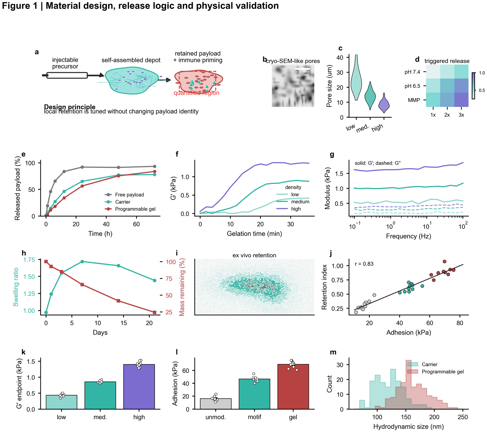
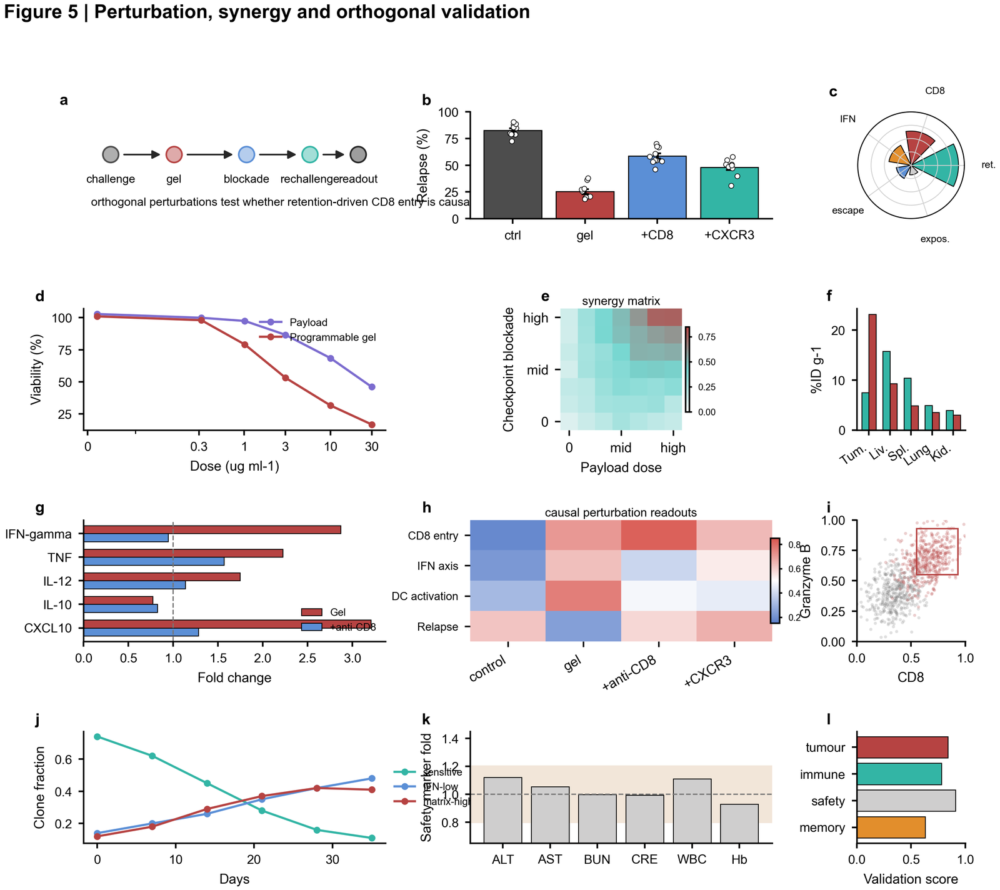
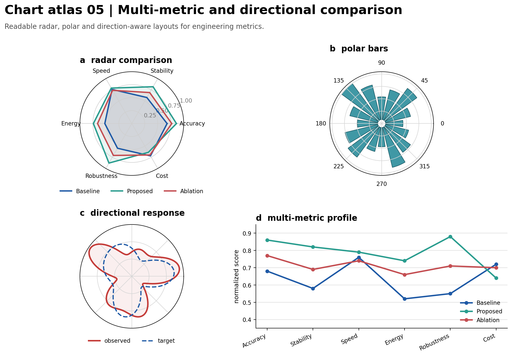
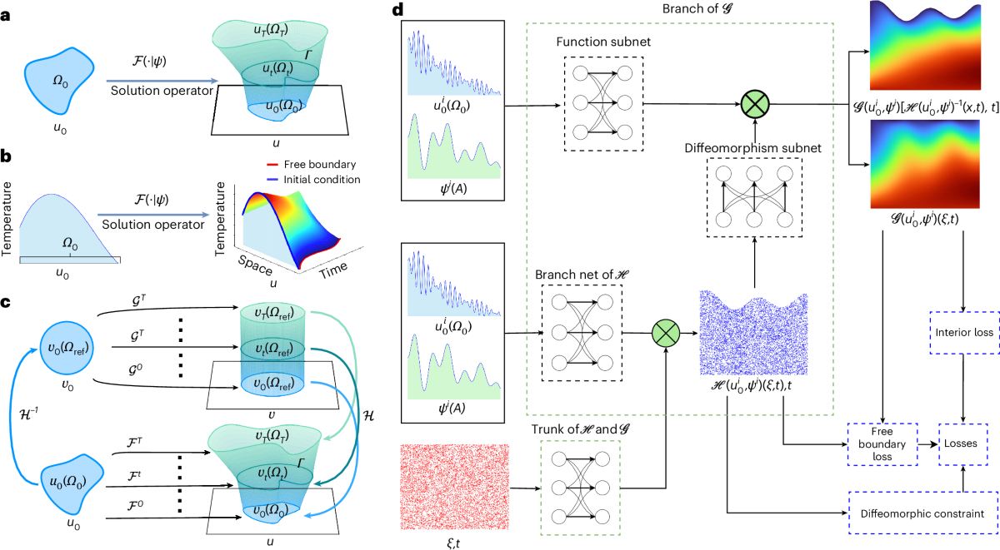
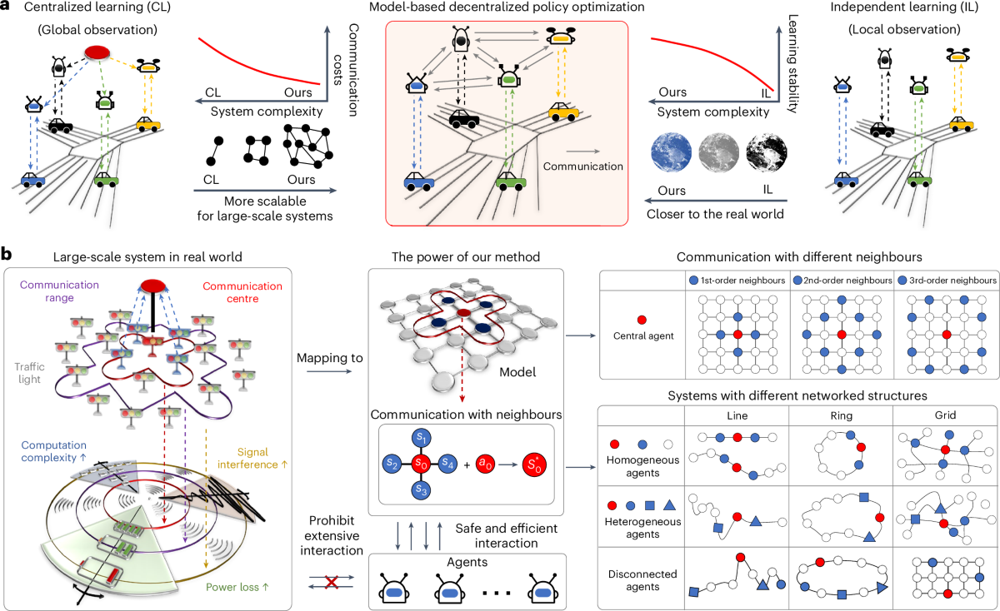
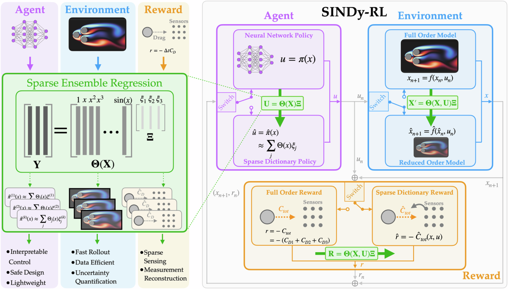
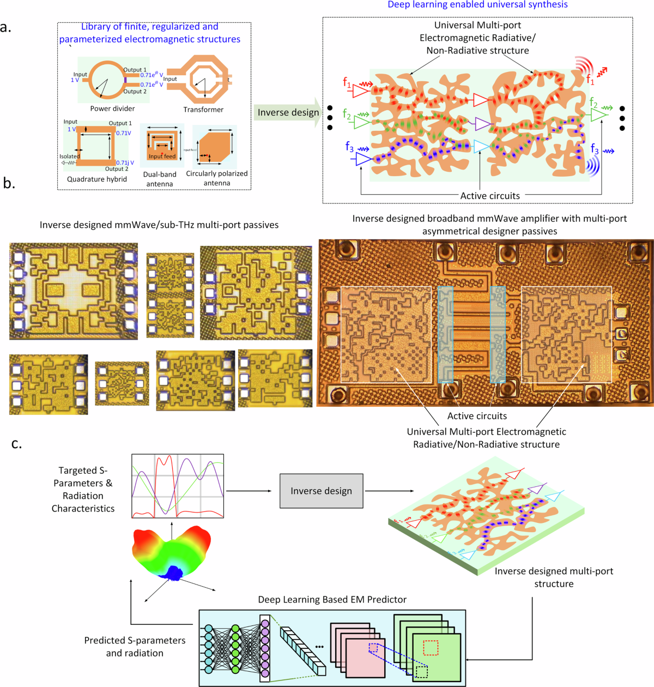
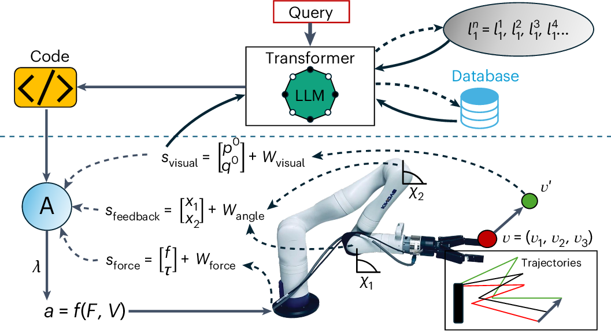
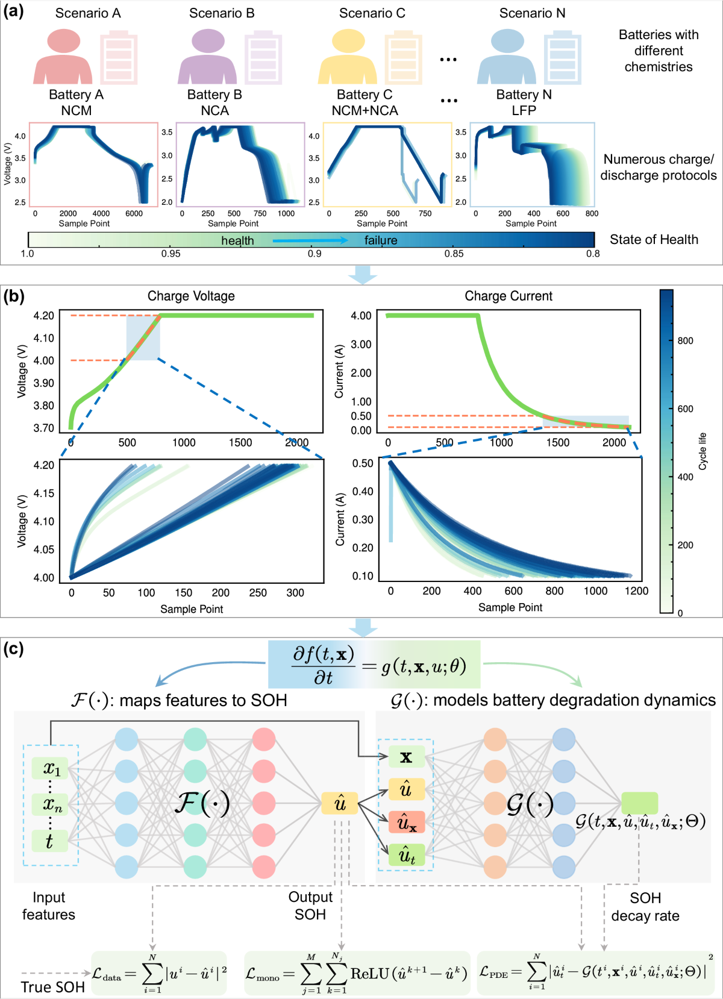

# Engineer Research Skills

给中文工科研究生、科研新手和第一次写论文的人准备的一套 Codex skills。

如果你正在准备自己的第一篇论文，可能会遇到很多很真实的困难：英文文献看不懂，不知道哪些句子值得引用；GitHub 项目跑不起来，不知道 `train.py` 和 `config.yaml` 到底在干什么；实验结果有了，却不知道怎么画成一张像论文里的图。

这套技能包想做的事情，就是陪你把这些关卡一个个拆开。它不是替你“编论文”，也不是让你跳过科研训练，而是像一个耐心的师兄师姐一样，从 0 到 1 帮你学会做科研：读懂一篇论文，跑通一段代码，组织一个实验，画出一张能支撑结论的图，最后慢慢知道自己的工作应该放在整个研究领域的什么位置。

科研最难的地方，很多时候不是你不努力，而是没有人把“第一步怎么走”讲清楚。这个项目就是为那一步准备的。

## 效果预览

这套 skills 不是只给你一段文字建议，而是希望把“科研输出”真正做出来：读文献能落到写作，读代码能落到复现，画图能落到论文表达。

下面这些是 `engineer-figure` 中内置的示例图，展示它希望达到的图形质量和论文表达方式。

### 论文级多面板图

一张好的论文图不只是把数据摆出来，而是把“方法、证据、验证、结论”组织成一条能说服审稿人的证据链。





### 图型能力预览

除了完整的多面板图，也可以根据论文需要选择雷达图、极坐标图、网络图、矩阵图、热图、趋势图等更适合工科结果表达的图型。

| 多指标/方向性比较 | 网络与矩阵关系 |
|---|---|
|  |  |

### 工科参考图谱

工科论文的好图，往往不是单纯的结果柱状图，而是把“物理系统、算法流程、仿真证据、控制闭环、工程验证”放在同一张图里。下面这些参考图更接近控制、仿真、机器人、逆向设计、物理约束建模等工科场景。

| 仿真代理 / 神经算子 | 网络控制 / 强化学习 |
|---|---|
|  |  |

| 可解释控制 / 模型分解 | 逆向设计 / 工程优化 |
|---|---|
|  |  |

| 机器人 / 具身智能 | 电池 / 物理约束建模 |
|---|---|
|  |  |

> 注：当前仓库仍处于私有审查阶段。上面的工科参考图主要用于内部审查和视觉方向选择。公开发布前，建议再次检查 `engineer-figure/assets/` 中所有示例图和第三方参考素材的来源与许可证；不确定可再分发的图片，可以改成只保留论文链接、图片链接和“视觉结构说明”。

## 适合谁使用

- 刚进课题组，不知道英文论文该从哪里读起的研究生
- 正在写第一篇中文小论文、课程论文、开题报告或毕业论文的人
- 看见 GitHub 项目 README、`train.py`、`config.yaml` 就头大的新手
- 需要把英文前沿文献转成中文论文引言、相关工作、讨论材料的作者
- 想做工科、控制、仿真、深度学习、机器人、能源、材料、信号处理等方向论文图的人
- 想让 AI 帮忙，但又不想得到一堆空泛总结的人

你不需要一开始就很懂编程，也不需要已经熟悉论文套路。只要你愿意把自己的问题、论文、代码、实验数据一点点交给它，它会尽量用中文把背后的逻辑讲清楚。

## 从 0 到 1 做科研

第一篇论文通常不是从“写作”开始的，而是从一连串小问题开始的：

```text
这个方向到底在研究什么？
这篇英文论文为什么重要？
我能不能复现别人的方法？
我的实验结果说明了什么？
这张图能不能支撑我的结论？
我的工作和别人相比到底新在哪里？
```

这套 skills 把这个过程拆成三个最常见的入口。

1. 先用 `engineer-literature` 读文献  
   帮你从英文论文里抓住研究问题、技术路线、实验依据和可引用的观点。

2. 再用 `engineer-read-code` 读代码  
   帮你看懂 README、训练脚本、仿真程序、评估流程和变量含义。

3. 最后用 `engineer-figure` 做图  
   帮你把方法、实验、对比和结论组织成论文里真正能说服人的图。

这不是一条捷径，而是一套陪跑路线。你仍然需要判断、实验、修改和负责，但它会尽量让你不再一个人卡在最初的迷雾里。

## 这套包包含什么

### 1. `engineer-literature`

读英文前沿文献，并转成中文科研写作素材。

适合这些场景：

- “帮我读这篇英文论文，告诉我对我的中文论文有什么用。”
- “这个方向最近有哪些前沿工作？”
- “帮我把这些文献整理成 related work。”
- “这句话需要什么文献支撑？”
- “这篇文章的方法、实验、局限性分别是什么？”

它会尽量输出：

- 这篇文章解决什么问题
- 核心方法是什么
- 实验证据强不强
- 和已有工作的区别
- 局限性和可攻击点
- 可以写进中文论文的角度
- 后续应该继续追哪些关键词

它最适合帮你完成第一篇论文里最痛苦的一步：把“我看过很多论文”变成“我知道这个领域的问题、方法和 gap 是什么”。

### 2. `engineer-read-code`

用中文给小白解释工科代码、README、脚本和小项目。

适合这些场景：

- “我是小白，帮我读懂这个 `train.py`。”
- “这个 README 让我先 install requirements，再 run evaluate.py，这每一步是干嘛的？”
- “这个仿真脚本里每个变量代表什么物理意义？”
- “这段控制/深度学习/数据处理代码怎么运行？”
- “我想改一个参数，会影响哪里？”

它会优先讲：

- 这段代码或项目是干什么的
- 输入是什么，输出是什么
- 运行顺序是什么
- 关键语法是什么意思
- 工程变量对应什么物理量、信号、轨迹、指标或模型
- 新手最容易在哪里报错
- 建议先读哪些文件

它不会默认你已经懂项目结构，也不会一上来就说一堆术语。它会先告诉你：这个项目想解决什么科研问题，你应该从哪里开始读，哪一步是安装，哪一步是训练，哪一步是评估，最后生成的结果在哪里。

### 3. `engineer-figure`

面向工科论文的高质量画图 workflow。

适合这些场景：

- “帮我画一张论文级方法框架图。”
- “把我的结果画成 Nature/高水平期刊风格。”
- “这个控制算法需要机制图、轨迹证据和指标对比。”
- “中文论文里的图字体太小、排版太乱，帮我重做。”
- “我要导出 SVG/PDF/TIFF 用于投稿。”

它的原则是：先确定图要证明什么，再决定怎么画。不会一上来就默认柱状图、折线图或热图。

特别注意：这个 skill 在真正画图前会要求你选择 `Python` 或 `R`，然后全程只用你选的后端生成、预览和导出图片。

对新手来说，画图最重要的不是“好看”，而是“这张图到底在帮我证明什么”。`engineer-figure` 会逼你先想清楚核心结论、证据链和审稿人可能会问的问题，再开始画。

## 推荐使用方式

### 读一篇论文

你可以这样问：

```text
Use $engineer-literature 阅读这篇论文。请用中文告诉我：
1. 它解决什么工程问题；
2. 核心方法是什么；
3. 实验证据是否充分；
4. 能不能写进我的引言或相关工作。
```

如果你问“最新”“前沿”“近几年”，它应该先检索或核验来源，而不是只靠记忆回答。

### 看一个科研代码项目

你可以这样问：

```text
Use $engineer-read-code 帮我读懂这个项目 README。我是小白，请先讲这个项目想解决什么问题，再讲怎么安装、怎么训练、怎么评估、输出文件在哪里。
```

如果你贴的是代码片段，它会从“这段代码是干什么的”开始讲，不会直接堆语法名词。

### 做一张论文图

你可以这样问：

```text
Use $engineer-figure 帮我设计一张工科论文图。
我的结论是：新方法在复杂扰动下比基线控制器更稳定。
我有轨迹误差、控制输入、成功率和消融实验数据。
```

如果你没有说用 Python 还是 R，它会先问你：

```text
Python or R?
```

## 一个典型科研流程

你可以把三件套连起来用：

1. 用 `engineer-literature` 读英文前沿文献，整理研究 gap 和相关工作。
2. 用 `engineer-read-code` 看懂论文配套代码、复现实验或理解别人项目。
3. 用 `engineer-figure` 把自己的方法、实验和对比结果画成论文图。

例如：

```text
先用 $engineer-literature 帮我读这 5 篇关于 physics-informed GNN 的论文，
整理成中文 related work。

然后用 $engineer-read-code 帮我读懂其中一个开源项目的 README 和 train.py。

最后用 $engineer-figure 帮我把我的方法流程和实验结果设计成一张多面板论文图。
```

如果你正在从零开始写第一篇论文，也可以这样用：

```text
我是一名刚入门的工科研究生，准备做第一篇论文。
我的方向是 XXX，但我还不太清楚该怎么开始。

请先用 $engineer-literature 帮我梳理这个方向最近 3-5 年的研究主线，
再告诉我应该读哪些代表性论文、关注哪些方法和指标。
```

然后逐步追问：

```text
这篇论文我没读懂，请帮我用中文解释它的问题、方法、实验和局限性。
```

```text
这是它的开源代码 README，请用 $engineer-read-code 告诉我怎么跑起来。
```

```text
这是我的实验结果，请用 $engineer-figure 帮我设计一张能支撑论文结论的图。
```

## 安装方式

把三个 skill 文件夹放到你的 Codex skills 目录下：

```text
~/.codex/skills/
  engineer-literature/
  engineer-read-code/
  engineer-figure/
```

Windows 上通常类似：

```text
C:\Users\<你的用户名>\.codex\skills\
```

放好后，重启或刷新 Codex，让它重新发现 skills。

## 目录结构建议

```text
engineer-research-skills/
  README.md
  engineer-literature/
    SKILL.md
    references/
    agents/
    evals/
  engineer-read-code/
    SKILL.md
    agents/
    evals/
  engineer-figure/
    SKILL.md
    references/
    assets/
    agents/
    evals/
```

## 使用时的几个提醒

- AI 可以陪你读、整理、比较、画图，但论文里的事实、引用和结论仍然需要你最终负责。
- 只要涉及“最新文献”“前沿进展”“引用支撑”，都应该要求它检索或核验来源。
- 读代码时，不要一开始就问“逐行解释所有文件”。先读 README、入口脚本、配置文件和输出目录。
- 画图时，先告诉它你的核心结论。没有结论的图，很容易变成好看的装饰。
- 中文论文图不要盲目追求极小字号。可读性优先，尤其是给导师、审稿人和答辩委员看的图。

刚开始做科研时，慢一点没有关系。重要的是每读一篇论文，都能多明白一点问题；每跑通一个脚本，都能多理解一点方法；每画一张图，都能更清楚地表达自己的结论。

## 这套技能包不做什么

- 不替你伪造实验结果。
- 不编造不存在的文献。
- 不保证任何未经核验的引用一定正确。
- 不默认复制论文原图作为你的图。
- 不鼓励把 AI 输出原样粘进论文。

## 适合继续扩展的方向

后续可以继续增加：

- `engineer-writing`: 中文论文初稿、引言、摘要、讨论写作
- `engineer-response`: 审稿意见回复
- `engineer-experiment`: 实验设计、消融实验、指标体系
- `engineer-reproduce`: 论文代码复现与环境整理
- `engineer-presentation`: 组会/开题/答辩 PPT

这套包现在先从最基础、最常用的三件事开始：读文献、读代码、画论文图。

愿它能陪你把第一篇论文从“完全不知道怎么开始”，慢慢推进到“我知道自己在研究什么，也知道该怎么表达它”。
