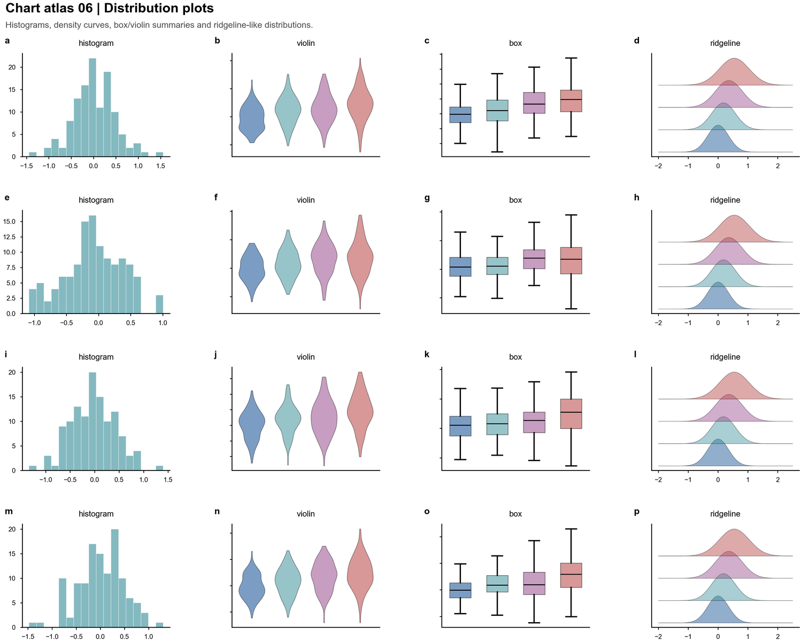
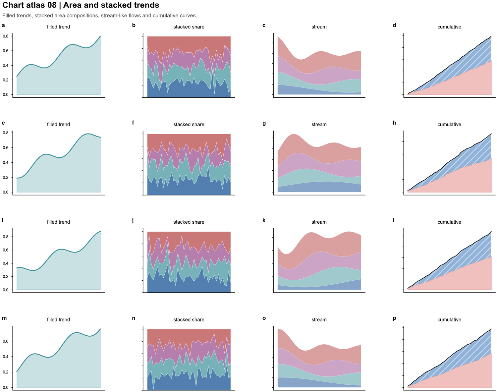
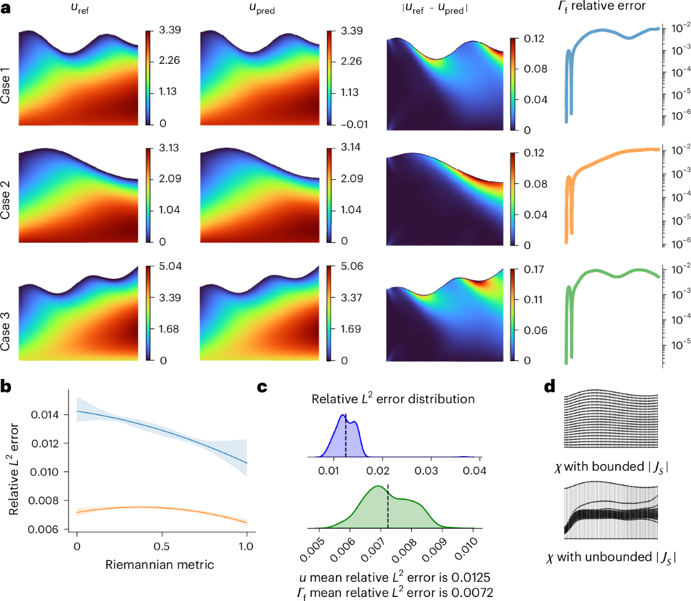
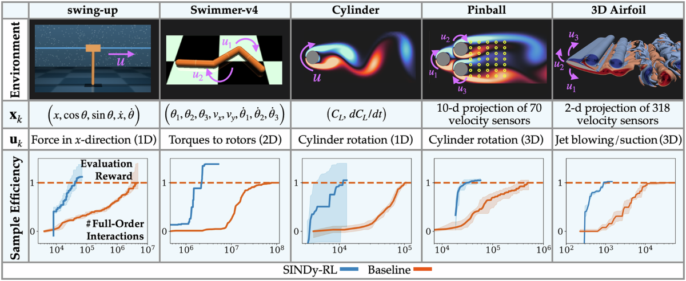
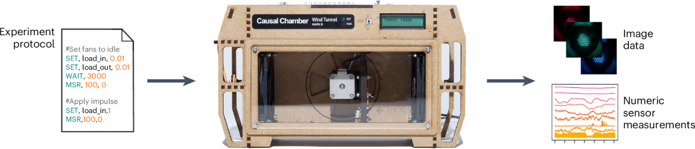

# Engineer Research Skills

面向中文工科研究生、科研初学者和首次开展论文写作的使用者的一套 Codex skills。

本项目旨在提供一组面向工程科研训练的 AI 辅助工作流，覆盖英文前沿文献阅读、科研代码理解、实验结果表达和论文级图形制作。它关注研究生在第一篇论文中最常遇到的基础问题：如何读懂领域文献，如何理解开源代码，如何组织实验结果，如何将方法与证据表达为清晰、规范、可复用的论文材料。

这套技能包强调从 0 到 1 的科研入门过程：从理解一篇论文开始，到复现一段代码、整理一组实验、设计一张支撑结论的图，逐步建立对研究问题、技术路线、证据链和学术表达的基本判断。

项目定位不是替代研究者完成科研判断，而是为中文工科学生提供结构化、可解释、可追溯的辅助工具。

## 效果预览

这套 skills 不仅提供文字解释，也强调将科研输入转化为可执行的研究产出：文献阅读服务于写作，代码理解服务于复现，图形设计服务于论文表达。

以下是 `engineer-figure` 中相对清晰、可控的图型示例，用于展示其覆盖的基础图形能力：比较、趋势、热图、分布、网络关系、矩阵关系等。

### 图型能力预览

一张有效的论文图不只是呈现数据，而是将“方法、证据、验证、结论”组织成能够支撑论文论证的证据链。对于科研初学者，优先掌握清晰、准确、可读的基础图型，比盲目堆叠复杂多面板更重要。

| 比较图 | 趋势图 |
|---|---|
|  |  |

| 热图 | 分布图 |
|---|---|
|  |  |

| 多指标/方向性比较 | 网络与矩阵关系 |
|---|---|
|  |  |

| 不确定性/区间 | 堆叠面积/组成变化 |
|---|---|
|  |  |

### 工科论文图的方向

高质量工科论文图通常需要将“物理系统、算法流程、仿真证据、控制闭环、工程验证”组织在同一证据结构中。`engineer-figure` 的参考图谱覆盖以下方向：

- 神经算子、PINN、物理约束 GNN、数字孪生和仿真代理模型
- 控制系统、强化学习、轨迹跟踪、鲁棒性和闭环反馈
- 逆向设计、工程优化、代理仿真器和设计空间搜索
- 机器人、具身智能、传感反馈和真实实验平台
- 电池、能源系统、复杂动力学和可解释模型

### 工科高质量图示例

以下示例展示了工程论文中常见的高质量图形组织方式：物理场预测、控制任务验证、网络化系统建模、逆向设计、实验平台和物理约束建模。

| 神经算子 / 物理场预测 | 控制任务 / 轨迹验证 |
|---|---|
|  |  |

| 网络控制 / 多智能体系统 | 逆向设计 / 工程优化 |
|---|---|
|  |  |

| 实验平台 / 传感数据 | 能源系统 / 物理约束建模 |
|---|---|
|  |  |

图像示例用于说明本项目面向的工程图形类型。公开发布时，应依据各图像来源的许可条款确认再分发方式。

## 适合谁使用

- 刚进入课题组、需要建立英文文献阅读方法的研究生
- 正在撰写第一篇中文论文、课程论文、开题报告或毕业论文的学生
- 需要理解 GitHub 项目 README、`train.py`、`config.yaml` 等科研代码材料的初学者
- 需要把英文前沿文献转成中文论文引言、相关工作、讨论材料的作者
- 需要制作工科、控制、仿真、深度学习、机器人、能源、材料、信号处理等方向论文图的研究者
- 希望获得结构化 AI 辅助，而不是泛泛总结的科研使用者

使用者无需预先具备完整的编程或论文写作经验。只要提供具体问题、论文、代码或实验数据，本项目会以中文解释其背后的研究逻辑、工程含义和表达方式。

## 从 0 到 1 做科研

第一篇论文通常不是从直接写作开始，而是从一系列基础判断开始：

```text
这个方向到底在研究什么？
这篇英文论文为什么重要？
我能不能复现别人的方法？
我的实验结果说明了什么？
这张图能不能支撑我的结论？
我的工作和别人相比到底新在哪里？
```

这套 skills 将上述过程拆分为三个常用入口。

1. 先用 `engineer-literature` 读文献  
   用于从英文论文中提取研究问题、技术路线、实验依据和可引用观点。

2. 再用 `engineer-read-code` 读代码  
   用于理解 README、训练脚本、仿真程序、评估流程和变量含义。

3. 最后用 `engineer-figure` 做图  
   用于将方法、实验、对比和结论组织为支撑论文论证的图形。

这套工具不替代科研训练本身。研究者仍需完成判断、实验、修改和核验，但可以借助这些 skills 更有序地推进第一篇论文。

## 技能组成

### 1. `engineer-literature`

读英文前沿文献，并转成中文科研写作素材。

适合这些场景：

- “帮我读这篇英文论文，告诉我对我的中文论文有什么用。”
- “这个方向最近有哪些前沿工作？”
- “帮我把这些文献整理成 related work。”
- “这句话需要什么文献支撑？”
- “这篇文章的方法、实验、局限性分别是什么？”

默认输出包括：

- 这篇文章解决什么问题
- 核心方法是什么
- 实验证据强不强
- 和已有工作的区别
- 局限性和可攻击点
- 可以写进中文论文的角度
- 后续应该继续追哪些关键词

它适合将分散的论文阅读转化为结构化认识：明确领域问题、主要方法、证据类型和可写入论文的研究缺口。

### 2. `engineer-read-code`

用中文解释工科代码、README、脚本和小型科研项目。

适合这些场景：

- “我是科研初学者，帮我读懂这个 `train.py`。”
- “这个 README 让我先 install requirements，再 run evaluate.py，这每一步是干嘛的？”
- “这个仿真脚本里每个变量代表什么物理意义？”
- “这段控制/深度学习/数据处理代码怎么运行？”
- “我想改一个参数，会影响哪里？”

它会优先讲：

- 这段代码或项目是干什么的
- 输入是什么，输出是什么
- 运行顺序是什么
- 关键语法是什么意思
- 工程变量对应什么物理量、信号、轨迹、指标或模型
- 初学者常见阻塞点
- 建议先读哪些文件

它会优先说明项目目标、代码入口、运行流程、输入输出和常见阻塞点，避免只解释语法而忽略科研项目的整体结构。

### 3. `engineer-figure`

面向工科论文的高质量画图 workflow。

适合这些场景：

- “帮我画一张论文级方法框架图。”
- “把我的结果画成 Nature/高水平期刊风格。”
- “这个控制算法需要机制图、轨迹证据和指标对比。”
- “中文论文里的图字体太小、排版太乱，帮我重做。”
- “我要导出 SVG/PDF/TIFF 用于投稿。”

核心原则是：先确定图形需要支撑的结论，再决定具体图型。该 skill 不会默认将所有结果处理为柱状图、折线图或热图。

注意：该 skill 在绘图前会要求选择 `Python` 或 `R`，随后全程只使用所选后端生成、预览和导出图片。

对于科研初学者，图形设计的核心不是装饰效果，而是图形是否能够支撑论文结论。`engineer-figure` 会先明确核心结论、证据链和潜在审稿问题，再进入绘图流程。

## 推荐使用方式

### 读一篇论文

示例请求：

```text
Use $engineer-literature 阅读这篇论文。请用中文告诉我：
1. 它解决什么工程问题；
2. 核心方法是什么；
3. 实验证据是否充分；
4. 能不能写进我的引言或相关工作。
```

涉及“最新”“前沿”“近几年”等时，应先检索或核验来源，而不是只依赖模型记忆。

### 看一个科研代码项目

示例请求：

```text
Use $engineer-read-code 帮我读懂这个项目 README。我是科研初学者，请先讲这个项目想解决什么问题，再讲怎么安装、怎么训练、怎么评估、输出文件在哪里。
```

如果输入的是代码片段，该 skill 会先解释代码用途，再进入语法和执行逻辑说明。

### 做一张论文图

示例请求：

```text
Use $engineer-figure 帮我设计一张工科论文图。
我的结论是：新方法在复杂扰动下比基线控制器更稳定。
我有轨迹误差、控制输入、成功率和消融实验数据。
```

如果未指定 Python 或 R，该 skill 会先询问：

```text
Python or R?
```

## 一个典型科研流程

三个 skills 可以组成一个连续工作流：

1. 用 `engineer-literature` 读英文前沿文献，整理研究 gap 和相关工作。
2. 用 `engineer-read-code` 看懂论文配套代码、复现实验或理解别人项目。
3. 用 `engineer-figure` 把自己的方法、实验和对比结果画成论文图。

例如：

```text
先用 $engineer-literature 帮我读这 5 篇关于 physics-informed GNN 的论文，
整理成中文 related work。

然后用 $engineer-read-code 帮我读懂其中一个开源项目的 README 和 train.py。

最后用 $engineer-figure 帮我把我的方法流程和实验结果设计成一张多面板论文图。
```

从零开始准备第一篇论文时，可采用以下请求：

```text
我是一名刚入门的工科研究生，准备做第一篇论文。
我的方向是 XXX，但我还不太清楚该怎么开始。

请先用 $engineer-literature 帮我梳理这个方向最近 3-5 年的研究主线，
再告诉我应该读哪些代表性论文、关注哪些方法和指标。
```

然后逐步追问：

```text
这篇论文我没读懂，请帮我用中文解释它的问题、方法、实验和局限性。
```

```text
这是它的开源代码 README，请用 $engineer-read-code 告诉我怎么跑起来。
```

```text
这是我的实验结果，请用 $engineer-figure 帮我设计一张能支撑论文结论的图。
```

## 安装方式

将三个 skill 文件夹放到 Codex skills 目录下：

```text
~/.codex/skills/
  engineer-literature/
  engineer-read-code/
  engineer-figure/
```

Windows 系统通常类似：

```text
C:\Users\<你的用户名>\.codex\skills\
```

放置完成后，重启或刷新 Codex，使其重新发现 skills。

## 目录结构建议

```text
engineer-research-skills/
  README.md
  engineer-literature/
    SKILL.md
    references/
    agents/
    evals/
  engineer-read-code/
    SKILL.md
    agents/
    evals/
  engineer-figure/
    SKILL.md
    references/
    assets/
    agents/
    evals/
```

## 使用注意事项

- AI 可以辅助阅读、整理、比较和绘图，但论文中的事实、引用和结论仍需由研究者最终核验。
- 涉及“最新文献”“前沿进展”“引用支撑”时，应进行来源检索或核验。
- 阅读代码项目时，建议优先理解 README、入口脚本、配置文件和输出目录，再进入逐行解释。
- 设计论文图时，应先明确核心结论和证据链，再选择具体图型。
- 中文论文图应优先保证可读性，避免为了追求期刊终版效果而过度压缩字号和间距。

本项目强调循序渐进的科研训练：通过文献阅读理解问题，通过代码阅读理解方法，通过图形设计表达证据。

## 边界说明

- 不生成或伪造实验结果。
- 不编造不存在的文献、数据集、指标或结论。
- 不保证未经核验的引用一定正确。
- 不默认复制论文原图作为用户论文图。
- 不建议将 AI 输出未经审查地直接写入论文。

## 适合继续扩展的方向

后续可继续扩展：

- `engineer-writing`: 中文论文初稿、引言、摘要、讨论写作
- `engineer-response`: 审稿意见回复
- `engineer-experiment`: 实验设计、消融实验、指标体系
- `engineer-reproduce`: 论文代码复现与环境整理
- `engineer-presentation`: 组会/开题/答辩 PPT

当前版本聚焦三项基础能力：读文献、读代码、画论文图。
